# GeoRock-2D


## Uncertainty-Aware Seismic Rockhead Characterization Using Synthetic Travel-Time Data and Sparse Boreholes

**GeoRock-2D** is an independent computational geophysics mini-research project that investigates how synthetic seismic travel-time information and sparse borehole observations affect the accuracy, spatial completeness, and uncertainty of two-dimensional engineering rockhead characterization.

The project implements a transparent Python workflow covering synthetic geological modelling, conceptual travel-time forward modelling, sensitivity-matrix construction, regularized slowness inversion, ray-coverage evaluation, engineering rockhead extraction, sparse-borehole integration, and empirical Monte Carlo uncertainty analysis.

> **Scope statement:** All geological models and observations in this repository are synthetic. The project is a methodological demonstration, does not propose a new inversion algorithm, and has not been validated using field data.

## Project Highlights

- Built a 196 × 2,700 path-length sensitivity matrix.
- Evaluated seven regularization strengths.
- Reduced local rockhead RMSE from 9.186 m to 0.762 m using coverage-aware interpretation.
- Integrated three sparse synthetic boreholes into a full-profile rockhead model.
- Quantified uncertainty using 50 repeated noise realizations.
- Added nine unit tests for model, forward-response, and sensitivity calculations.

---

## Research Question

**How does the integration of seismic travel-time information and sparse borehole constraints affect the accuracy and uncertainty of 2D engineering rockhead characterization?**

### Supporting questions

1. How accurately can a regularized travel-time inversion recover an undulating synthetic soil–rock interface?
2. How strongly does ray-path coverage affect the reliability of the interpreted rockhead?
3. How sensitive is the recovered interface to regularization strength and velocity-threshold selection?
4. Can sparse boreholes improve a spatially incomplete geophysical interpretation?
5. How does measurement noise propagate into full-profile rockhead uncertainty?

---

## Scientific Motivation

Boreholes provide direct subsurface information but are usually sparse and cannot fully resolve laterally variable rockhead geometry. Geophysical measurements can supply spatially continuous information between boreholes, although their interpretation remains non-unique and sensitive to measurement noise, acquisition geometry, regularization, resolution, and geological assumptions.

This project evaluates the complementary roles of:

- seismic travel-time observations;
- ray-path coverage and spatial resolution;
- regularized slowness inversion;
- engineering-interface extraction;
- sparse borehole constraints;
- empirical uncertainty quantification.

The central engineering premise is that subsurface interpretations should distinguish between:

- areas directly constrained by observations;
- areas controlled mainly by regularization;
- areas inferred through interpolation or geological assumptions.

---

## Conceptual Workflow

```text
Synthetic 2D soil–rock velocity model
                    ↓
Surface sources and receivers
                    ↓
Conceptual subsurface ray paths
                    ↓
Path-length sensitivity matrix G
                    ↓
Synthetic noiseless travel times
                    ↓
Gaussian measurement noise
                    ↓
Regularized slowness inversion
                    ↓
Ray-coverage and resolution assessment
                    ↓
Coverage-aware rockhead extraction
                    ↓
Sparse synthetic borehole constraints
                    ↓
Borehole-constrained interface interpretation
                    ↓
Monte Carlo uncertainty analysis
                    ↓
Engineering site-characterization discussion
```

The linearized travel-time relationship is written as:

$$
\mathbf{d} = \mathbf{G}\mathbf{m} + \boldsymbol{\varepsilon}
$$

where:

- $\mathbf{d}$ is the travel-time vector;
- $\mathbf{G}$ is the path-length sensitivity matrix;
- $\mathbf{m}$ is the cell-slowness vector;
- $\boldsymbol{\varepsilon}$ represents observational error.

The inverse problem is solved through bounded regularized least squares:

$$
\min_{\mathbf{m}}
\left\|
\mathbf{G}\mathbf{m} - \mathbf{d}
\right\|_2^2
+
\lambda^2
\left\|
\mathbf{L}\mathbf{m}
\right\|_2^2
$$

where $\mathbf{L}$ is a first-order spatial smoothness operator and
$\lambda$ controls the trade-off between data fit and model smoothness.

---

## Synthetic Geological Model

The synthetic domain is:

```text
Profile length : 120 m
Model depth    : 45 m
Horizontal cell size : 2 m
Vertical cell size   : 1 m
Total cells          : 2,700
```

The model contains:

| Material zone | Synthetic P-wave velocity |
|---|---:|
| Soil or weathered material | 650 m/s |
| Transition zone | 1,200 m/s |
| Competent rock | 2,800 m/s |
| Local fractured/weathered rock anomaly | 1,850 m/s |

The undulating rockhead combines sinusoidal and Gaussian geometric components. These values are modelling assumptions and are not calibrated to a particular site in Singapore.

### True synthetic model

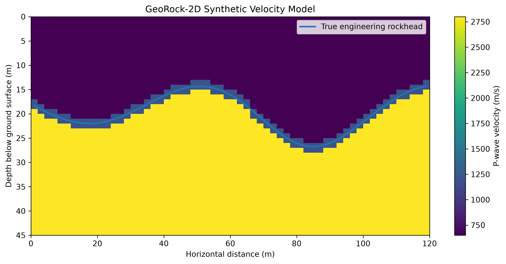

---

## Acquisition and Forward Modelling

The acquisition geometry contains:

```text
Sources   : 7
Receivers : 30
Valid source–receiver pairs : 196
```

A conceptual V-shaped ray geometry is used to create a transparent baseline for subsurface sensitivity and travel-time calculation.

The travel time for one ray is evaluated from:

$$
t = \sum_i \frac{\Delta s_i}{v_i}
$$

where $\Delta s_i$ is the segment length inside a model cell and
$v_i$ is the corresponding P-wave velocity.

### Important physical limitation

The V-shaped path is not a full seismic-refraction ray tracer. It does not solve the eikonal equation and does not explicitly reproduce curved rays, critical refraction, head waves, or realistic first-arrival picking. It is retained as a documented educational baseline for sensitivity-matrix construction.

### Conceptual ray paths

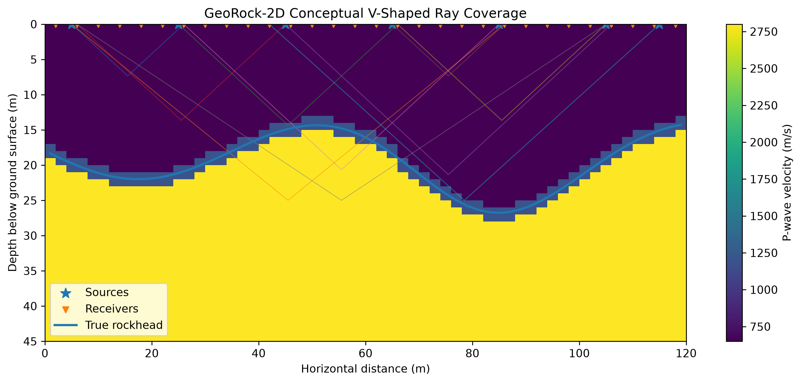

### Synthetic travel-time observations

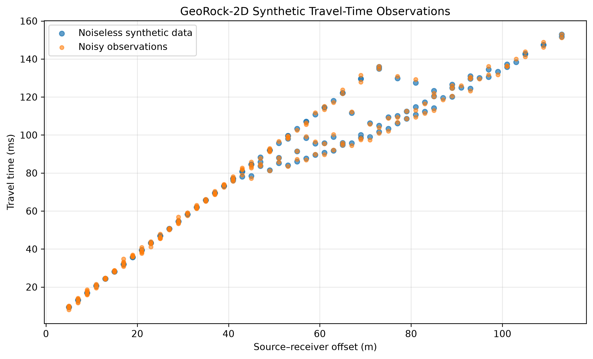

---

## Sensitivity Matrix and Ray Coverage

The path-length sensitivity matrix has dimensions:

```text
G shape = 196 observations × 2,700 model cells
```

Only **1,037 cells**, equivalent to **38.41% of the full model**, are crossed by at least one conceptual ray. The inverse problem is therefore strongly underdetermined.

This result is central to the interpretation: cells outside the illuminated region cannot be regarded as independently reconstructed from the travel-time data.

### Ray-path density

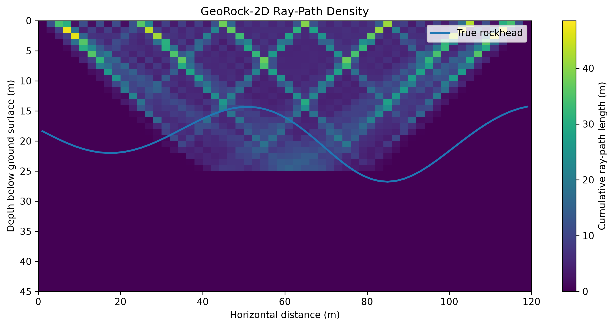

The highest ray density occurs in the central shallow-to-intermediate portion of the profile. Coverage decreases near the lateral boundaries and below the maximum turning depth.

---

## Regularized Inversion

The inversion estimates cell slowness rather than velocity directly. First-order horizontal and vertical smoothness constraints stabilize the underdetermined problem.

A series of regularization values was tested:

```text
λ = 0.1, 0.3, 1, 3, 10, 30, and 100
```

The selected synthetic benchmark value was:

```text
λ = 3
```

This value produced the lowest active-cell velocity RMSE against the known true synthetic model.

> Selection using the true model is valid only for synthetic benchmarking. For field applications, parameter selection would require L-curve analysis, cross-validation, estimated data uncertainty, geological knowledge, or independent borehole constraints.

### Regularization diagnostic

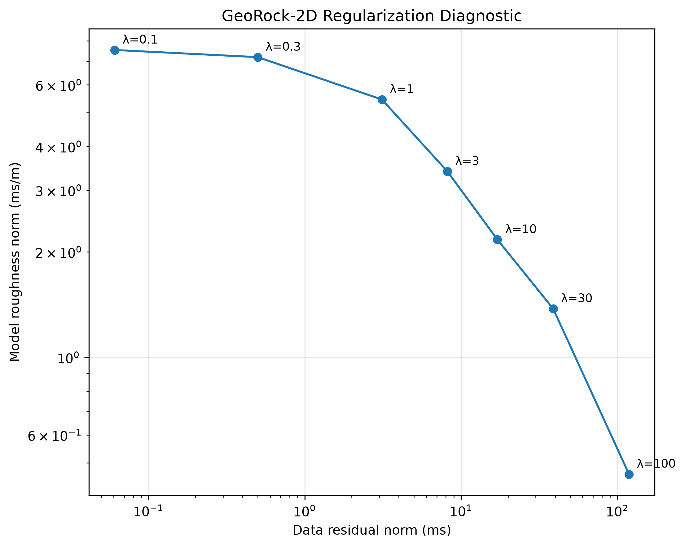

### Velocity error versus regularization

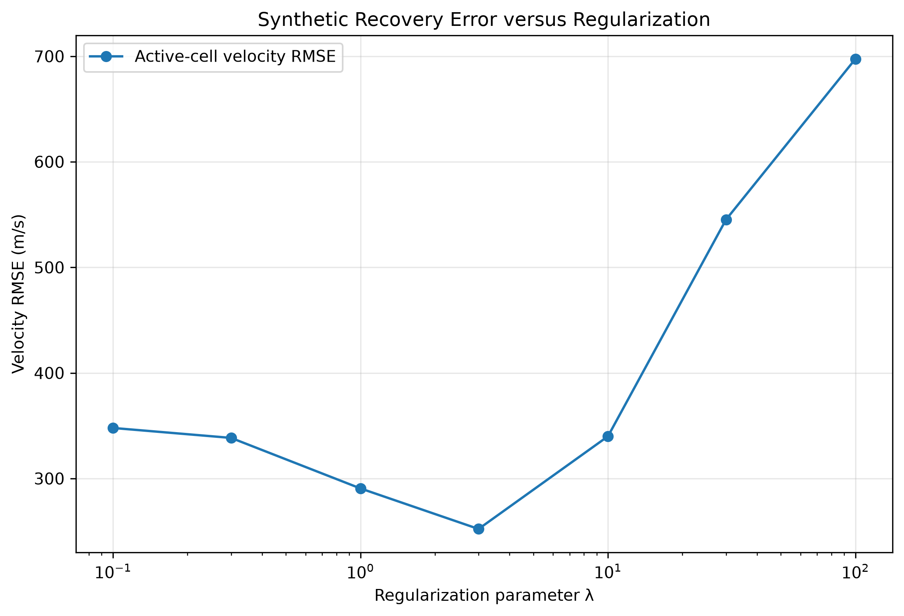

The first regularized inversion produced:

```text
Travel-time RMSE                  : 1.2215 ms
Active-cell velocity RMSE         : 339.95 m/s
Active-cell mean absolute error   : 139.83 m/s
Estimated active velocity range   : 585.6–2,817.0 m/s
```

The model recovers the main central high-velocity region but smooths the sharp soil–rock contrast and leaves unilluminated cells unconstrained.

---

## Rockhead Extraction

An initial maximum-gradient criterion produced spatially extensive but unreliable estimates:

```text
Valid-profile coverage : 81.67%
Rockhead MAE            : 7.333 m
Rockhead RMSE           : 9.186 m
Maximum error           : 16.178 m
```

The poor result occurred because local inversion and coverage artefacts were incorrectly identified as the engineering interface.

A more conservative method was therefore implemented using:

- normalized Gaussian smoothing;
- minimum and maximum depth limits;
- minimum ray-density requirements;
- a velocity-threshold crossing criterion;
- exclusion of unsupported model columns.

### Threshold-sensitivity analysis

The following thresholds were tested:

```text
1,400–2,000 m/s
```

The selected synthetic benchmark threshold was:

```text
1,400 m/s
```

It achieved:

```text
Valid-profile coverage : 35.00%
Rockhead MAE            : 0.719 m
Rockhead RMSE           : 0.762 m
```

This result demonstrates a key trade-off: stricter coverage screening substantially improved local reliability but reduced spatial completeness.

### Threshold sensitivity

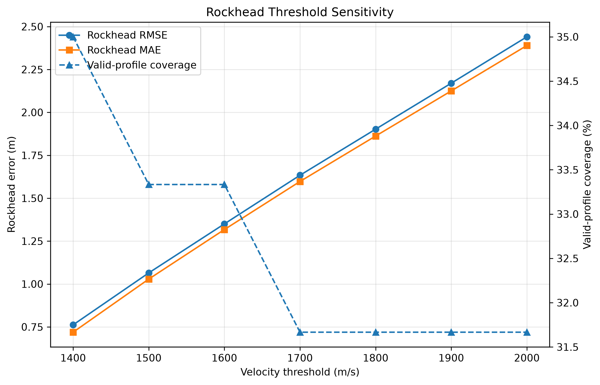

### Selected geophysics-only rockhead estimate

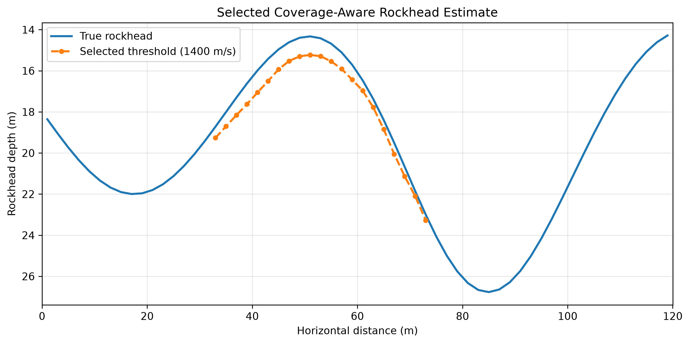

---

## Sparse Borehole Integration

Three synthetic boreholes were introduced at:

| Borehole | Position |
|---|---:|
| BH-1 | 18 m |
| BH-2 | 58 m |
| BH-3 | 103 m |

Synthetic borehole depth observations include a Gaussian depth error with:

```text
Standard deviation = 0.25 m
```

The workflow combines:

1. valid geophysical interface estimates;
2. sparse borehole rockhead observations;
3. shape-preserving interpolation;
4. local Gaussian distance-weighted borehole corrections.

The method is described as **borehole-constrained interface interpretation**, not joint inversion.

### Baseline and integrated results

| Scenario | Spatial coverage | MAE | RMSE |
|---|---:|---:|---:|
| Geophysics-only valid region | 35% | 0.719 m | 0.762 m |
| Full-profile baseline interpolation | 100% | 0.976 m | 1.399 m |
| Initial borehole correction, 22 m influence | 100% | 0.909 m | 1.435 m |
| Optimized borehole correction, 5 m influence | 100% | 0.874 m | 1.389 m |

The optimized local correction produced:

```text
MAE improvement relative to baseline  : 10.51%
RMSE improvement relative to baseline : 0.72%
```

The small RMSE improvement but clearer MAE reduction indicates that sparse boreholes were more effective as **local constraints** than as broad regional corrections.

### Borehole influence-length sensitivity

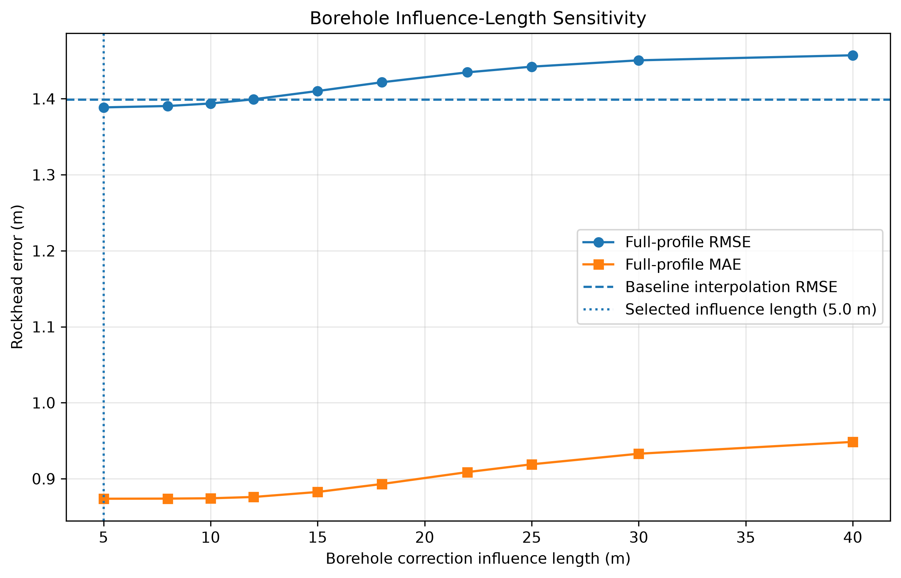

### Optimized geophysics–borehole interpretation

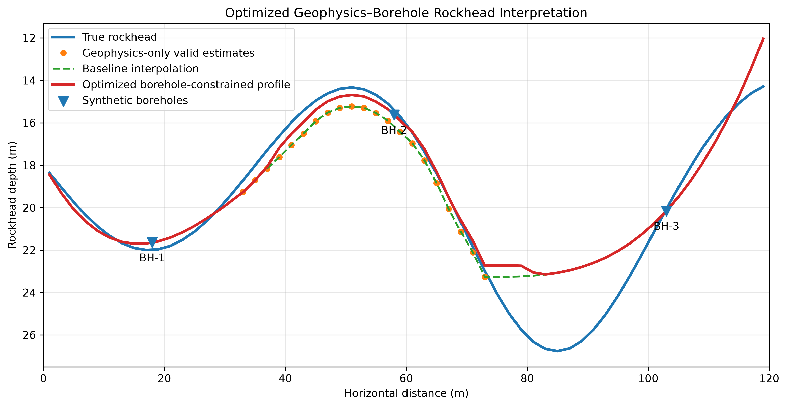

### Rockhead error along the profile

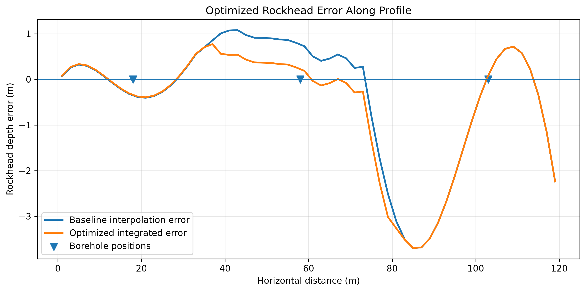

---

## Monte Carlo Uncertainty Analysis

Fifty repeated synthetic experiments were conducted.

For each realization:

1. a new travel-time noise vector was generated;
2. regularized slowness inversion was repeated;
3. the coverage-aware rockhead was extracted;
4. borehole observations received a new noise realization;
5. the full integrated rockhead profile was reconstructed.

The analysis produced:

```text
Number of realizations          : 50
Travel-time noise standard dev. : 1.0 ms
Regularization parameter        : λ = 3
Velocity threshold              : 1,400 m/s
Borehole influence length       : 5 m
```

### Mean integrated profile

```text
Mean error             : -0.390 m
Mean absolute error    : 1.014 m
RMSE                   : 1.532 m
Maximum absolute error : 3.543 m
```

### Across individual realizations

```text
Mean RMSE              : 1.722 m
RMSE standard deviation: 0.369 m
Minimum RMSE           : 1.115 m
Maximum RMSE           : 2.510 m
```

### Empirical uncertainty

```text
Mean 95% interval width    : 2.223 m
Maximum interval width     : 10.805 m
Empirical coverage         : 71.67%
```

The empirical coverage is substantially lower than the nominal 95% level. This indicates that repeated measurement noise alone does not capture all sources of uncertainty, particularly structural model error, threshold selection, acquisition simplifications, and interpolation assumptions.

### Monte Carlo uncertainty band

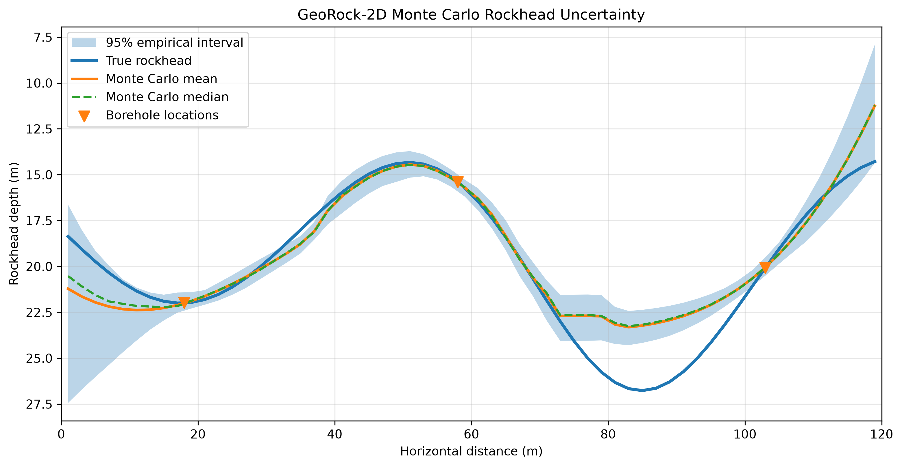

### Uncertainty width along the profile

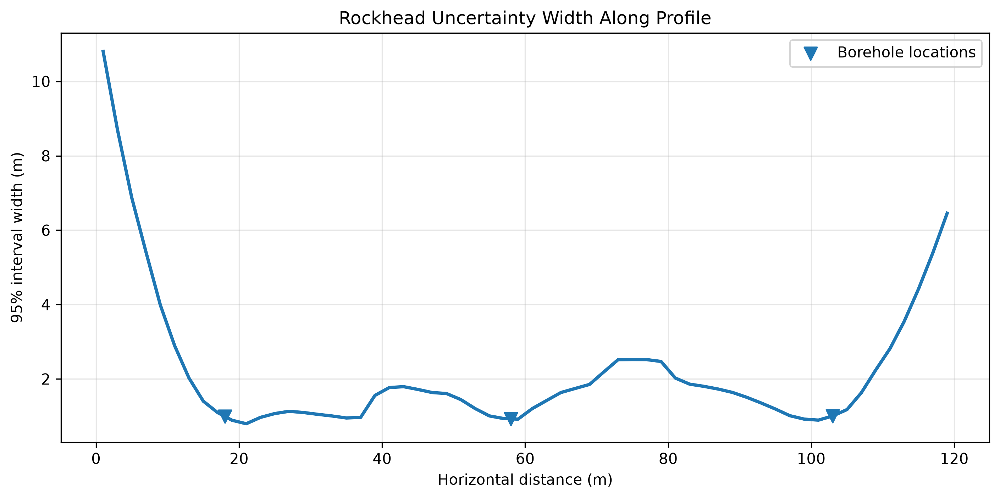

### RMSE distribution

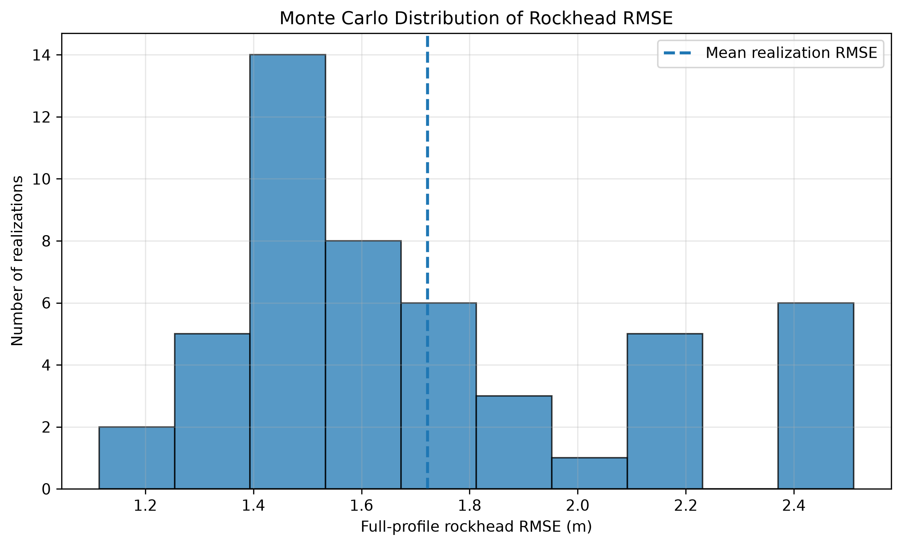

---

## Main Findings

The synthetic experiments support the following observations:

1. **A low travel-time residual does not guarantee reliable geological-interface recovery.**  
   The first inversion fitted the observations reasonably well, yet the unconstrained gradient-based rockhead extraction produced large geological errors.

2. **Ray coverage is a primary control on interpretation reliability.**  
   Only 38.41% of the model cells were illuminated, and reliable interface estimates were concentrated in the central part of the profile.

3. **Conservative interpretation improves local accuracy.**  
   Coverage-aware thresholding reduced rockhead RMSE from 9.186 m to 0.762 m, although valid-profile coverage decreased to 35%.

4. **Sparse boreholes improve spatial completeness.**  
   Combining boreholes with the partial geophysical estimate produced a continuous full-profile interpretation.

5. **Borehole influence should remain local.**  
   An influence length of 5 m performed better than broader correction lengths, indicating that wide corrections can degrade areas already represented reasonably well.

6. **Noise propagation alone underestimates total uncertainty.**  
   The 95% empirical interval covered the true rockhead at only 71.67% of profile positions, highlighting unrepresented structural and methodological uncertainties.

---

## Engineering Interpretation

The workflow suggests that a subsurface interpretation should not be presented as uniformly reliable across the survey domain.

For engineering site characterization:

- ray-density maps should accompany inversion results;
- unsupported cells should be explicitly masked;
- interface extraction criteria should undergo sensitivity analysis;
- boreholes should be treated as direct but spatially local constraints;
- uncertainty should be reported spatially rather than as a single global value;
- additional investigation should target model boundaries, deeper rockhead depressions, and regions with limited ray overlap.

---

## Repository Structure

```text
GeoRock-2D/
│
├── README.md
├── LICENSE
├── requirements.txt
├── .gitignore
│
├── data/
│   ├── processed/
│   └── synthetic/
│
├── docs/
├── notebooks/
├── references/
├── report/
│
├── results/
│   ├── figures/
│   ├── models/
│   └── tables/
│
├── scripts/
│   ├── plot_true_model.py
│   ├── plot_ray_paths.py
│   ├── generate_dataset.py
│   ├── add_noise.py
│   ├── plot_travel_times.py
│   ├── build_sensitivity_matrix.py
│   ├── add_noise_linear.py
│   ├── run_regularized_inversion.py
│   ├── analyze_regularization.py
│   ├── extract_rockhead_improved.py
│   ├── analyze_rockhead_threshold.py
│   ├── integrate_boreholes.py
│   ├── analyze_borehole_influence.py
│   └── run_monte_carlo.py
│
├── src/
│   └── georock2d/
│       ├── acquisition.py
│       ├── boreholes.py
│       ├── forward.py
│       ├── inversion.py
│       ├── model.py
│       ├── regularization.py
│       └── sensitivity.py
│
└── tests/
```

---

## Installation

Clone the repository:

```powershell
git clone https://github.com/ndimassaputro/GeoRock-2D.git
cd GeoRock-2D
```

Create a virtual environment:

```powershell
python -m venv .venv
```

Activate the environment in Windows PowerShell:

```powershell
Set-ExecutionPolicy -Scope Process -ExecutionPolicy Bypass
.\.venv\Scripts\Activate.ps1
```

Install dependencies:

```powershell
python -m pip install --upgrade pip
pip install -r requirements.txt
```

---

## Reproducing the Workflow

Run the scripts from the repository root in the following order:

```powershell
python .\scripts\plot_true_model.py
python .\scripts\plot_ray_paths.py
python .\scripts\generate_dataset.py
python .\scripts\add_noise.py
python .\scripts\plot_travel_times.py
python .\scripts\build_sensitivity_matrix.py
python .\scripts\add_noise_linear.py
python .\scripts\run_regularized_inversion.py
python .\scripts\analyze_regularization.py
python .\scripts\extract_rockhead_improved.py
python .\scripts\analyze_rockhead_threshold.py
python .\scripts\integrate_boreholes.py
python .\scripts\analyze_borehole_influence.py
python .\scripts\run_monte_carlo.py
```

Generated outputs are stored in:

```text
results/figures/
results/tables/
results/models/
```

---

## Software Requirements

The project was developed using Python 3.12 and the following main packages:

```text
NumPy
SciPy
pandas
Matplotlib
PyYAML
pytest
```

Only Matplotlib is used for visualization.

---
## Testing

The repository includes nine unit tests covering the synthetic geological
model, conceptual forward modelling, and path-length sensitivity matrix.

Run the complete test suite from the repository root:

```powershell
pytest -v
```

The tests verify:

- expected model dimensions;
- finite and positive P-wave velocities;
- rockhead geometry within the model domain;
- correct conceptual ray endpoints;
- positive travel-time calculations;
- increasing path length with source–receiver offset;
- sensitivity-matrix dimensions of 196 × 2,700;
- finite and non-negative path-length values;
- consistency of the linear forward response.

Current local test result:

```text
9 passed
```

---


## Assumptions

The following are synthetic modelling assumptions rather than site-calibrated values:

- model dimensions and discretization;
- P-wave velocity values;
- rockhead geometry;
- fractured-zone geometry;
- acquisition layout;
- conceptual ray turning depth;
- travel-time noise magnitude;
- borehole depth noise;
- velocity threshold;
- borehole correction influence length.

These assumptions are used to demonstrate the methodology and should not be interpreted as representative parameters for a specific geological formation.

---

## Limitations

The present version is limited by:

- fully synthetic data;
- conceptual V-shaped ray paths;
- no eikonal or shortest-path solver;
- no refracted first-arrival physics;
- no velocity-dependent ray bending;
- simplified two-dimensional geometry;
- limited source–receiver coverage;
- no field calibration;
- no formal Bayesian inversion;
- no genuine joint geophysical–borehole inversion;
- threshold selection using the known synthetic truth;
- borehole influence selection using synthetic benchmark error;
- uncertainty based mainly on repeated noise realizations;
- no explicit uncertainty in geological model structure.

---

## Potential Future Development

Potential improvements include:

1. replacing the conceptual ray geometry with shortest-path or eikonal travel-time modelling;
2. testing denser and alternative acquisition configurations;
3. implementing spatially variable data weighting;
4. using second-order or anisotropic regularization;
5. evaluating L-curve curvature automatically;
6. incorporating boreholes through explicit penalty terms;
7. propagating uncertainty in threshold and regularization selection;
8. comparing deterministic and Bayesian interface updating;
9. introducing real field or published benchmark datasets;
10. extending the geometry to marine and offshore acquisition.

---

## Relevance to Geotechnical and Geophysical Research

GeoRock-2D demonstrates the integration of concepts that are relevant to engineering subsurface characterization:

- travel-time forward modelling;
- inverse-problem formulation;
- regularization;
- resolution and ray-coverage assessment;
- engineering rockhead interpretation;
- sparse borehole integration;
- uncertainty quantification.

The project also provides a computational bridge between the author's geotechnical background and research interests in subsurface imaging, geological interpretation, and geomechanical site characterization.

---

## Potential Extension to Marine and Offshore Investigations

The underlying computational ideas may be extended to marine or offshore studies, including:

- travel-time survey design;
- offshore subsurface velocity reconstruction;
- integration with marine boreholes or core logs;
- uncertainty analysis for seabed or rockhead characterization;
- identification of poorly constrained survey regions.

The current implementation remains land-based and does not model:

- the water column;
- ocean-bottom sensors;
- marine source signatures;
- streamer geometry;
- seismic reflection processing;
- environmental and navigation noise;
- three-dimensional marine acquisition physics.

---

## Reference Basis

The scientific background of the project includes literature on:

- seismic travel-time tomography;
- discrete inverse theory;
- regularized inverse problems;
- geological modelling;
- soil–rock interface characterization;
- integration of borehole and geophysical information;
- uncertainty in engineering geological models.

A structured literature matrix is available in:

[`references/literature_matrix.md`](references/literature_matrix.md)

### Selected Reference Groups

The literature matrix includes references concerning:

- geological modelling for underground construction in Singapore;
- uncertainty-aware soil–rock interface identification using boreholes;
- comparison of borehole-derived geological profiles and geophysical testing;
- seismic travel-time tomography and spatial resolution;
- discrete inverse theory and regularized parameter estimation.

---

## Citation

This repository is currently an independent educational and methodological project. When referring to it, please use:

```text
Saputro, N. D. (2026). GeoRock-2D: Uncertainty-Aware Seismic
Rockhead Characterization Using Synthetic Travel-Time Data
and Sparse Boreholes. GitHub repository.
```

---

## Author

**Nurwahid Dimas Saputro**  
Master of Engineering Candidate  
Civil and Environmental Engineering  
Ehime University, Japan

Research interests:

- geotechnical engineering;
- ground improvement;
- subsurface characterization;
- computational geophysics;
- engineering geology;
- uncertainty-aware site investigation.

---

## License

This project is distributed under the MIT License. See [`LICENSE`](LICENSE) for details.